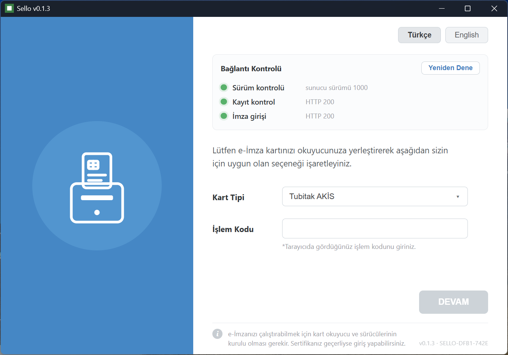

  

  <b>e-Devlet'e ve UYAP'a (e-Adalet) akıllı kart e-imzanızla girişi TEK uygulamada toplayan, Java'sız, tek dosya Windows uygulaması.</b> 
  <b>e-Devlet e-İmza Uygulaması</b> ve <b>UYAP E-İmza</b>'nın Java yükünü ortadan kaldıran <b>bağımsız</b>, hafif, kendini güncelleyen bir alternatif.

  
  
  
  
  

  <a href="../../releases/latest/download/sello-app.exe"><b>⬇ Son sürümü indir (.exe)</b></a> &nbsp;·&nbsp;
  <a href="../../releases">Eski sürümler</a> &nbsp;·&nbsp;
  <a href="https://lordofthemachines.github.io/sello/">Tanıtım sayfası</a> &nbsp;·&nbsp;
  <a href="CHANGELOG.md">Sürüm geçmişi</a>

  

---

## 👥 Kimler için?

Her gün **UYAP** ve **e-Devlet**'e e-imzayla giren herkes için — Java derdi olmadan, saniyeler içinde:

- **Avukatlar** — UYAP Avukat Portal'da dava açma, icra takibi, dosya inceleme.
- **Bilirkişiler & arabulucular** — Bilirkişi/Arabulucu Portallarına e-imzayla giriş.
- **Vatandaşlar** — e-Devlet'e elektronik imza ile güvenli giriş.

## 🎯 İki sistem, tek uygulama

İki ayrı e-imza istemcisinin yaptığı işi Sello tek başına görür — ayrı program ve Java kurmazsınız:

| | |
|---|---|
| 🏛️ **e-Devlet** | Tarayıcıda "Elektronik İmza ile Giriş" adımını Sello penceresi üstlenir: kartı okur, işlem kodunu alır, PIN'inizle imzalar, girişi tamamlar. *(e-Devlet e-İmza Uygulaması yerine — Java yok.)* |
| ⚖️ **UYAP / e-Adalet** | Sello arka planda tepside durur ve yerel bir imza köprüsü açar; UYAP portallarındaki imza kartınızla bu köprüden alınır. *(UYAP E-İmza istemcisine alternatif.)* UYAP E-İmza kuruluysa çakışmamak için köprü devre dışı kalır. |

## ✨ Öne çıkanlar

| | |
|---|---|
| ⚡ **Java'sız & hızlı** | JVM, Web Start veya Python yok. Çift tıkla saniyeler içinde açılır. |
| 📦 **Tek dosya, taşınabilir** | Tek `.exe`. Kurulum gerekmez; USB'den bile çalışır. |
| 🖥️ **Sistem tepsisinde arka planda** | Sol çift-tık → e-Devlet penceresi. Sağ-tık → **Takılı Kartlar · Sistem Kontrolü · Ayarlar** (tek pencere, sekmeli). |
| ⚙️ **Tam kullanıcı kontrolü** | "Windows ile başlat" Ayarlar'dan açılıp kapatılır; **kendini kaldırma** ile tüm izler temizlenir. |
| 🌐 **Türkçe / İngilizce** | Dil değişimi tüm pencerelere ve tepsi menüsüne **anında** yansır. |
| 🔄 **İmzalı otomatik güncelleme** | Açılışta yeni sürümü görür, **ed25519 imzasıyla doğrular**, kendini yeniler. |
| 🛡️ **Kart güvenliği** | PIN sayacını düşürmeden okur; **son deneme hakkında** otomatik giriş yapmaz. Kilitli/boş PIN gönderilmez. |
| 🔒 **TLS her zaman açık** | Sertifika doğrulaması kapatılmaz; PIN ve imzalı veri loglanmaz. |

## ⬇ İndirme

> **[➤ Son sürümü indir — sello-app.exe](../../releases/latest/download/sello-app.exe)**  ·  [Eski sürümler](../../releases)

- **`sello-app.exe`** — **taşınabilir tek dosya** (kurulum yok, çift tıkla çalıştır). Kendini otomatik günceller.

> ⚠️ Yazılımı **yalnızca bu resmî dağıtım kaynağından** indirin; yeniden dağıtımı yasaktır. İndirip
> kullanarak **[Kullanım Sözleşmesi'ni (EULA)](LICENSE)** kabul etmiş olursunuz.

> **Önkoşul:** Windows 10/11 + akıllı kart okuyucusu ve kart sürücüsü (AKİS için `akisp11.dll`).

## 🚀 Kullanım

**e-Devlet'e giriş (dört adım):**

1. `.exe`'yi indir, çift tıkla; tepsi simgesi belirir. e-Devlet için tepsiye **çift tıkla** pencereyi aç.
2. **Kart Tipi** seç + tarayıcıdaki **İşlem Kodu**'nu gir → **DEVAM**.
3. **Sözleşme**yi gör → **DEVAM** → **PIN** gir → **İMZALA**.
4. e-Devlet girişin tamamlanır.

**UYAP (e-Adalet) için:** Sello tepside açık olduğu sürece ekstra adım yok — tarayıcıdaki UYAP
imza penceresinde kartınız ve PIN'inizle imzalarsınız; Sello köprüsü imzayı arka planda üretir.

**Tepsi menüsü (sağ-tık):** **Takılı Kartlar** (sahip, kimlik no, geçerlilik, PIN durumu) ·
**Sistem Kontrolü** (UYAP + e-Devlet bağlantıları) · **Ayarlar** (Windows ile başlat, dil TR/EN, kaldır).

## 🗑️ Kaldırma

Tepsi → **Ayarlar → "Sello'yu kaldır"**: autostart kaydı, yerel veri ve uygulama makineden
**tamamen** kaldırılır. (Yalnız başlangıçtan çıkarmak isterseniz "Windows ile başlat"ı kapatmanız yeter.)

## 🔒 Güvenlik ve gizlilik

- **TLS doğrulaması her zaman açık**; PIN loglanmaz, bellekte kısa tutulup silinir.
- Kart **kilitliyse** veya **son deneme hakkındaysa** giriş otomatik denenmez; uyarı verilir.
- İmza **akıllı kartın içinde** üretilir; kartın özel anahtarı dışarı çıkmaz.
- UYAP köprüsü yalnız **127.0.0.1**'de ve yalnız **onaylı UYAP alan adlarına** açıktır.

## 📋 Sürüm geçmişi

Bkz. [CHANGELOG.md](CHANGELOG.md).

## 📬 İletişim

Soru, öneri ve destek için geliştirici **Mehmet Gilik**:

- ✉️ **E-posta:** [gilikmehmet@gmail.com](mailto:gilikmehmet@gmail.com)
- 📞 **Telefon:** [+90 542 543 83 75](tel:+905425438375)

## 📄 Lisans

**Tescilli ücretsiz yazılım** (kaynak kod dağıtılmaz). Yalnızca **kişisel ve ticari olmayan**
kullanım içindir; **yeniden dağıtım yasaktır**. Yazılım **"olduğu gibi"** sunulur, **garanti
verilmez** ve tüm sorumluluk/risk kullanıcıdadır. Tam metin: **[LICENSE](LICENSE)** (TR + EN).

---

> **Bağımsızlık notu:** Sello bağımsız, üçüncü taraf bir uygulamadır; **TÜRKSAT**, **e-Devlet Kapısı**
> veya **T.C. Adalet Bakanlığı (UYAP)** ile resmî bir bağlantısı, ortaklığı ya da onayı yoktur.
> "e-Devlet", "UYAP", "e-Adalet" ve anılan diğer ürün/marka adları yalnızca uyumluluğu açıklamak
> için kullanılmıştır ve ilgili sahiplerine aittir.

© Mehmet Gilik · Bağımsız uygulama · Kaynak kod ayrı tutulur; bu depo yalnız dağıtım içindir.

